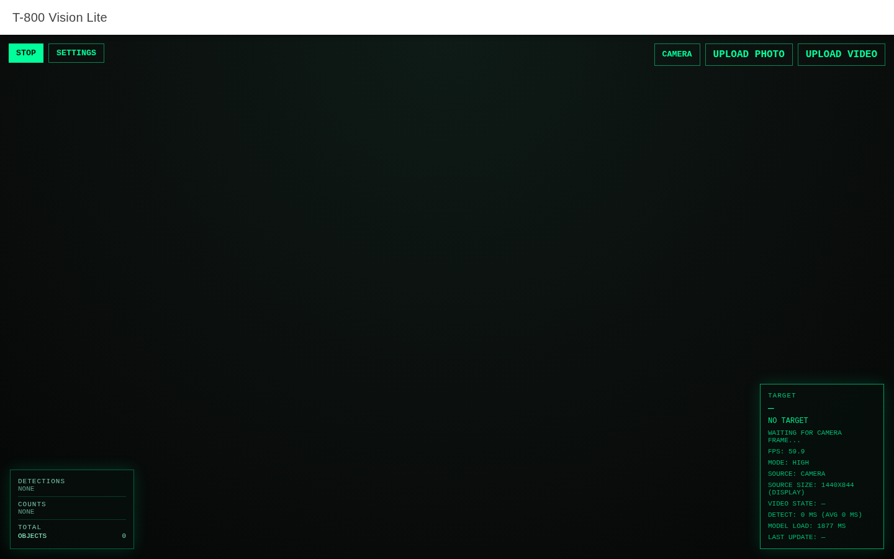
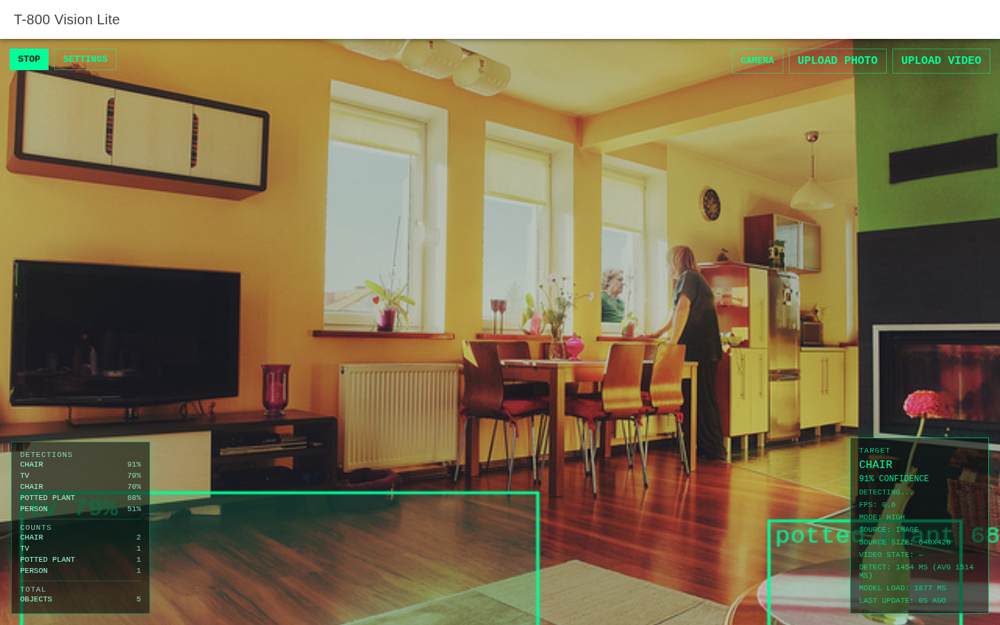
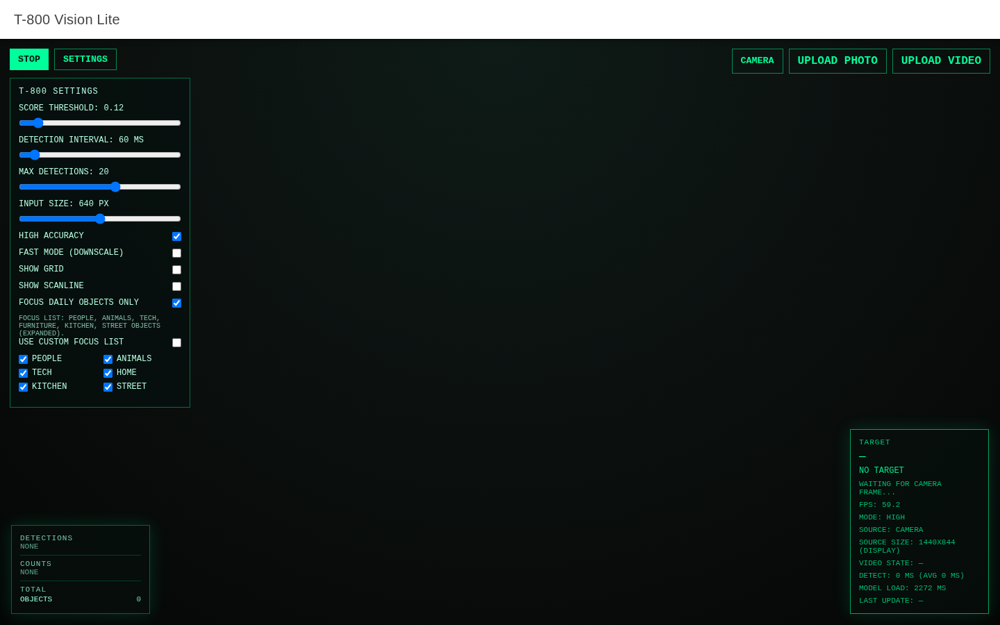
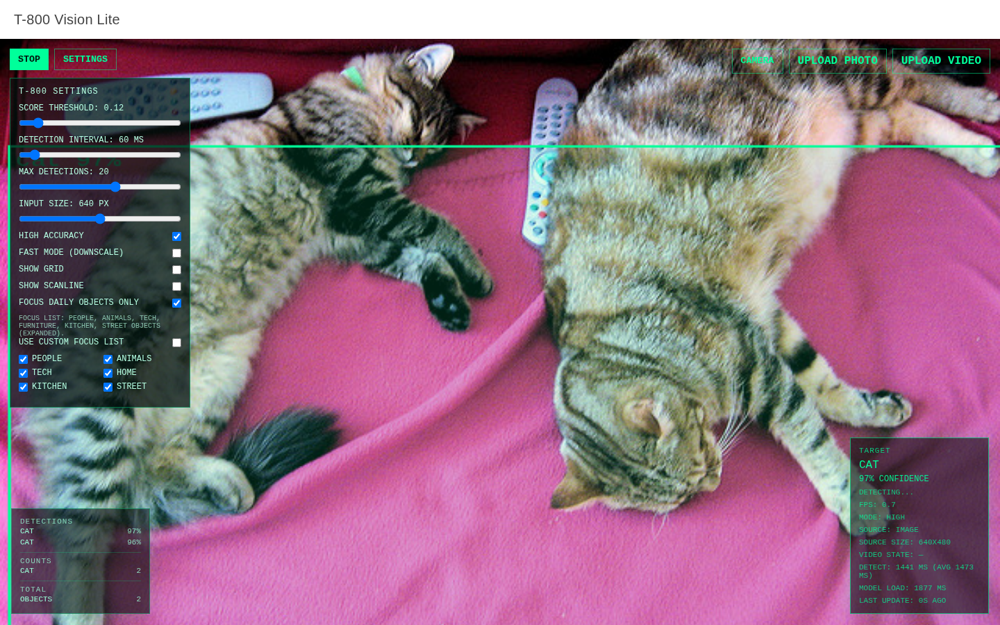
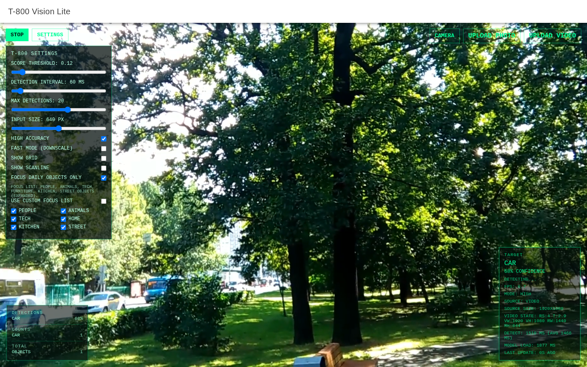
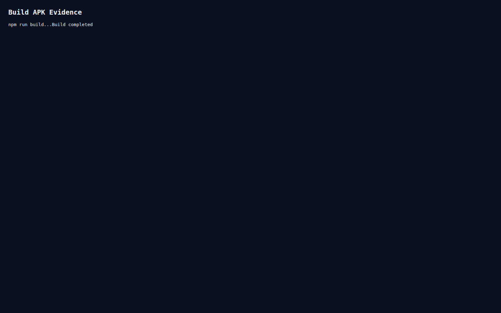

# AEA2 (RA2) — Entrega aplicació feta amb IA (Spec-Driven Development)

## 0) Dades de l’entrega
- Alumne: **Izan Rodriguez**
- Mòdul / RA: **RA2**
- Data: **2026-05-11**
- Repositori públic GitHub: **https://github.com/zaxtronic/specify**
- Stack: `Ionic + Vue 3 + Capacitor + TensorFlow.js + Coco-SSD`

---

## 1) Explicació de les funcionalitats de l’aplicació

### 1.1 Objectiu de l’aplicació
L’aplicació **T-800 Vision Lite** detecta objectes en temps real sobre càmera, imatge pujada o vídeo pujat, utilitzant inferència **on-device** amb TensorFlow.js (sense backend d’inferència).

### 1.2 Funcionalitats principals
- Captura de càmera en viu (`getUserMedia`) amb previsualització.
- Detecció d’objectes amb model `coco-ssd`.
- Overlay HUD estil sci-fi:
  - caixes (`bounding boxes`),
  - etiqueta de classe,
  - percentatge de confiança.
- Panell de telemetria:
  - objectiu principal detectat,
  - FPS,
  - temps de detecció actual i mitjà,
  - estat del model i de la font.
- Modes d’entrada:
  - `camera`,
  - `image upload`,
  - `video upload`.
- Configuració en temps real:
  - llindar de confiança,
  - interval de detecció,
  - màxim de deteccions,
  - resolució d’entrada,
  - mode `HIGH/FAST`.
- Filtrat de classes per focus:
  - llista predefinida (persones, animals, tech, casa, cuina, carrer),
  - llista custom separada per comes.

### 1.3 Casos d’ús
1. L’usuari obre l’app, autoritza càmera i veu deteccions en temps real.
2. L’usuari puja una foto i veu objectes detectats sobre la imatge.
3. L’usuari puja un vídeo i inspecciona deteccions frame a frame.
4. L’usuari ajusta paràmetres per equilibrar precisió i rendiment en mòbil.

---

## 2) Captures de l’aplicació

> Inserir captures reals abans d’exportar el PDF.

### 2.1 Pantalla principal en mode càmera


### 2.2 Deteccions + HUD (FPS, confiança, objectiu)


### 2.3 Menú de settings (threshold, interval, input size)


### 2.4 Mode imatge pujada


### 2.5 Mode vídeo pujat


### 2.6 Build Android (sortida terminal / APK)


---

## 3) Procés d’especificació (Spec-Driven Development)

Metodologia aplicada: **Speckit/OpenSpec** amb tres fases principals.

### 3.1 Foundations
Objectiu: definir context, abast i criteris d’èxit.

- Producte: detector d’objectes mòbil offline.
- Restricció clau: inferència local sense servidor.
- Tecnologia base: Ionic + Vue + Capacitor + TFJS.
- Criteris d’acceptació:
  - càmera funcional,
  - model carregat,
  - deteccions visibles,
  - overlay i HUD operatius,
  - build Android completat.

**Fitxer de referència:** `SPEC.md`

### 3.2 Specify
Objectiu: descriure comportament funcional esperat.

- Definició de flux càmera → inferència → dibuix overlay.
- Requisits UI/HUD i estats (`loading`, `ready`, `no objects`).
- Decisió de model (`coco-ssd`) i justificació de rendiment/precisió.

**Fitxers de referència:**
- `SPEC.md`
- `PROMPTS.md`

### 3.3 Planning
Objectiu: organitzar implementació i decisions tècniques.

- Seqüència de tasques per construir MVP i iterar.
- Decisions de rendiment (throttle, input size, mode fast).
- Integració Android amb Capacitor i validació en dispositiu.

**Fitxers de referència:**
- `PLAN.md`
- `TASKS.md`

---

## 4) Annex amb fitxers rellevants

### 4.1 `SPEC.md` (resum)
- Defineix objectiu, usuaris, casos d’ús i criteris d’acceptació.
- Inclou requeriments de rendiment i requisit offline.

### 4.2 `PLAN.md` (resum)
- Defineix arquitectura (`Ionic/Vue + TFJS + Coco-SSD + Canvas overlay`).
- Detalla passos tècnics d’implementació i riscos/mitigacions.

### 4.3 `TASKS.md` (resum)
- Checklist seqüencial del desenvolupament, des d’scaffold fins APK.

### 4.4 `PROMPTS.md` (resum)
- Traçabilitat dels prompts utilitzats amb IA per decisions de model, integració, rendiment i build.

### 4.5 Fragments textuals (opcional però recomanat)
Afegir com a annex final captures o fragments curts dels `.md` anteriors per evidència de procés.

---

## 5) Checklist final abans de lliurar

### Repositori GitHub
- [ ] Repositori **públic** i accessible sense permisos.
- [ ] Codi font complet pujat.
- [ ] README present amb instruccions de run/build.
- [ ] Fitxers de procés (`SPEC.md`, `PLAN.md`, `TASKS.md`, `PROMPTS.md`) inclosos.

### PDF
- [ ] Inclou els 4 apartats obligatoris.
- [ ] Captures inserides i llegibles.
- [ ] Enllaç del repositori visible a la primera pàgina.
- [ ] Format net (títols, seccions, paginació coherent).

---

## 6) Com exportar aquest document a PDF

Des de `specify-project`:

```bash
mkdir -p annex/screenshots
# (copiar aquí les captures abans d'exportar)
libreoffice --headless --convert-to pdf AEA2_ENTREGA.md --outdir .
```

Si la conversió directa de Markdown no preserva bé format/imatges:
1. Obre `AEA2_ENTREGA.md` amb VS Code.
2. Exporta a PDF amb extensió de Markdown PDF.
3. Desa com `AEA2_ENTREGA.pdf`.
